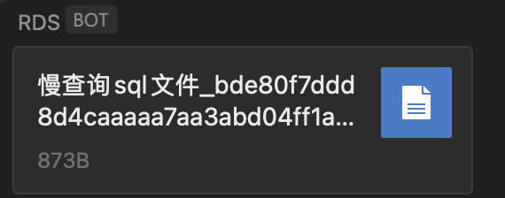
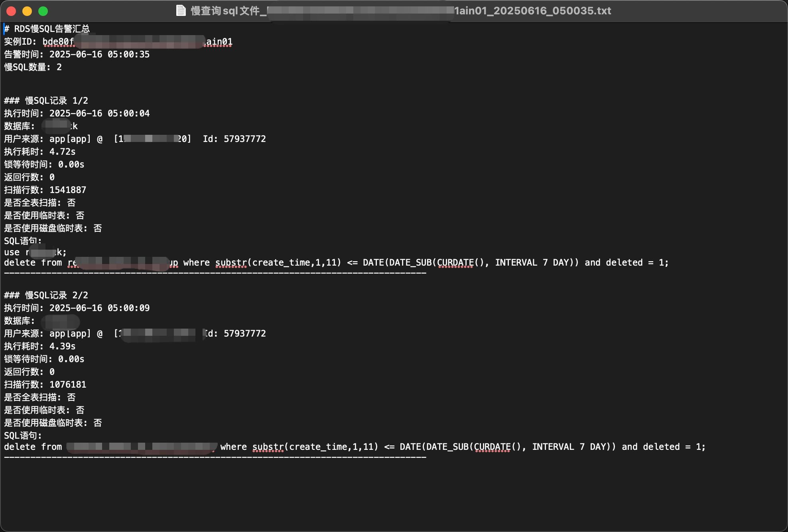

# RDS慢SQL监控告警程序




这是一个用于监控阿里云和华为云RDS实例慢SQL并通过企业微信发送告警的Python程序集合。

## 项目结构

```
RDS_SlOW_SQL/
├── aliyun_rds/                     # 阿里云RDS监控程序
│   ├── aliyun_rds_slow_sql_monitor.py
│   ├── config.ini
│   ├── requirements.txt
│   └── Dockerfile
├── huaweiyun_rds/                  # 华为云RDS监控程序
│   ├── huawei_rds_slow_sql_monitor.py
│   ├── config.ini
│   ├── requirements.txt
│   └── Dockerfile
└── README.md
```

## 功能特点

### 云RDS监控
- 支持监控多个RDS实例
- 支持每个实例监控指定数据库或所有数据库
- 定期获取RDS实例的慢SQL日志（默认每分钟一次）
- 按实例和数据库分割生成告警
- 通过企业微信webhook以文件形式发送告警信息
- 支持自定义监控时间间隔
- 支持CST/UTC时区自动转换
- 支持Docker容器化部署

#### 💡 技术方案说明

**为什么采用文件下载方式获取慢日志？**

虽然华为云和阿里云都提供了 `DescribeSlowLogRecords（忘记了会不会截断，官文没写，阿里测试较少）、ListSlowlogForLts` API 接口来直接查询慢日志记录，但是这些API接口存在一个共同的问题：


- **SQL截断问题**：当SQL语句过长时，API会自动截断SQL内容，导致返回的SQL显示不完整
- **影响排查**：不完整的SQL语句会严重影响开发人员对慢查询问题的分析和优化

因此，采用了不同的技术方案：
- **阿里云**：使用API方式，适合大部分场景的快速查询
- **华为云**：采用下载完整日志文件的方式，确保SQL语句的完整性

这样既保证了监控的实时性，又确保了SQL内容的完整性，便于问题排查和性能优化。

## 使用方式

### 阿里云RDS监控

#### 方式一：直接运行

1. 进入阿里云监控目录
```bash
cd aliyun_rds
```

2. 安装依赖
```bash
pip install -r requirements.txt
```

3. 配置文件
编辑 `config.ini` 文件，填入相关配置

4. 运行程序
```bash
python aliyun_rds_slow_sql_monitor.py
```

#### 方式二：Docker部署

1. 构建Docker镜像
```bash
cd aliyun_rds
docker build -t aliyun-rds-slow-sql-monitor .
```

2. 运行容器
```bash
# 使用配置文件挂载
docker run -d \
  --name aliyun-rds-slow-sql-monitor \
  -v $(pwd)/config.ini:/app/config.ini \
  aliyun-rds-slow-sql-monitor
```

### 华为云RDS监控

#### 方式一：直接运行

1. 进入华为云监控目录
```bash
cd huaweiyun_rds
```

2. 安装依赖
```bash
pip install -r requirements.txt
```

3. 配置文件
编辑 `config.ini` 文件，填入相关配置

4. 运行程序
```bash
python huawei_rds_slow_sql_monitor.py
```

#### 方式二：Docker部署

1. 构建Docker镜像
```bash
cd huaweiyun_rds
docker build -t huawei-rds-monitor .
```

2. 运行容器
```bash
docker run -d \
  --name huawei-rds-monitor \
  -v $(pwd)/config.ini:/app/config.ini \
  -v $(pwd)/logs:/app/logs \
  -v $(pwd)/alerts:/app/alerts \
  huawei-rds-monitor
```

## 配置说明

### 阿里云RDS配置

编辑 `aliyun_rds/config.ini` 文件：

```ini
[aliyun]
# 阿里云访问凭证
access_key_id = 您的阿里云AccessKey_ID
access_key_secret = 您的阿里云AccessKey_Secret

[instances]
# 要监控的实例ID列表，用逗号分隔
instance_list = rm-example001, rm-example002

# 每个实例的数据库配置
# 如果databases为空，则监控该实例下所有数据库
[rm-example001]
databases = db1, db2

[rm-example002]
databases = 

[wechat]
# 企业微信机器人webhook地址
webhook_url = https://qyapi.weixin.qq.com/cgi-bin/webhook/send?key=YOUR_KEY

[monitor]
# 监控间隔时间（秒）
query_interval = 60
```

### 华为云RDS配置

编辑 `huaweiyun_rds/config.ini` 文件：

```ini
[huaweicloud]
# 华为云访问凭证
access_key_id = 您的Access_Key_ID
access_key_secret = 您的Secret_Access_Key
project_id = 您的Project_ID
# 区域，默认为cn-north-4
region = cn-north-4

[instances]
# 实例ID列表，用逗号分隔
instance_list = instance-example001, instance-example002

[wechat]
# 企业微信机器人webhook地址
webhook_url = https://qyapi.weixin.qq.com/cgi-bin/webhook/send?key=YOUR_KEY

[monitor]
# 监控间隔时间（秒）
query_interval = 60
```

### 配置参数说明

#### 阿里云配置
- `access_key_id`: 阿里云账号的AccessKey ID
- `access_key_secret`: 阿里云账号的AccessKey Secret
- 建议使用RAM子账号的AccessKey，并只授予RDS只读权限

#### 华为云配置
- `access_key_id`: 华为云账号的Access Key ID
- `access_key_secret`: 华为云账号的Secret Access Key
- `project_id`: 项目ID
- `region`: 区域，默认为cn-north-4

#### 实例配置
- `instance_list`: 要监控的RDS实例ID列表，多个实例用逗号分隔
- 阿里云支持每个实例单独配置要监控的数据库列表
- 如果某个实例的`databases`配置为空，则监控该实例的所有数据库

#### 企业微信配置
- `webhook_url`: 企业微信机器人的Webhook地址
- 在企业微信群中添加机器人后可获取

#### 监控配置
- `query_interval`: 监控检查间隔时间，单位为秒

## 告警文件格式

两个监控程序都会生成标准格式的告警文件：

### 文件命名格式
- **阿里云**: `慢查询sql文件_{实例ID}_{数据库名}_{时间戳}.txt`
- **华为云**: `慢查询sql文件_{实例ID}_{时间戳}.txt`

### 文件内容格式

#### 汇总信息
- 数据库实例ID
- 数据库名称（阿里云）
- 告警时间
- 慢SQL数量

#### 详细信息（每条慢SQL记录）

**阿里云包含：**
- 执行时间（CST时区）
- 执行耗时（秒）
- 返回行数
- 解析行数
- 锁定时间（秒）
- 访问来源
- SQL哈希值
- SQL语句

**华为云包含：**
- 执行时间
- 数据库名称
- 用户来源
- 执行耗时（秒）
- 锁等待时间（秒）
- 返回行数
- 扫描行数
- 是否全表扫描
- 是否使用临时表
- 是否使用磁盘临时表
- SQL语句

## 日志说明

程序运行时会输出以下类型的日志：
- **INFO**: 正常运行信息，包括启动、监控和告警发送状态
- **ERROR**: 错误信息，包括API调用失败、告警发送失败等
- **DEBUG**: 调试信息，包括详细的API返回结果（需要调整日志级别）

## Docker部署说明

### 镜像特点
- 基于 Python 3.9 镜像构建
- 已配置好Asia/Shanghai时区
- 支持通过挂载配置文件进行配置
- 支持通过环境变量调整配置

### 容器管理命令

#### 阿里云监控容器
```bash
# 停止容器
docker stop aliyun-rds-slow-sql-monitor

# 启动容器
docker start aliyun-rds-slow-sql-monitor

# 重启容器
docker restart aliyun-rds-slow-sql-monitor

# 查看日志
docker logs -f aliyun-rds-slow-sql-monitor

# 删除容器
docker rm -f aliyun-rds-slow-sql-monitor
```

#### 华为云监控容器
```bash
# 停止容器
docker stop huawei-rds-monitor

# 启动容器
docker start huawei-rds-monitor

# 重启容器
docker restart huawei-rds-monitor

# 查看日志
docker logs -f huawei-rds-monitor

# 删除容器
docker rm -f huawei-rds-monitor
```

## 注意事项

### 权限设置
1. **权限**
   - 确保云账号有RDS只读权限
   - 建议使用RAM子账号并只授予必要权限

2. **通用**
   - 确保config.ini文件的权限设置正确，防止敏感信息泄露

### 网络要求
- 确保服务器可以访问对应云厂商的API
- 确保服务器可以访问企业微信API
- 华为云监控需要确保有足够的带宽下载日志文件

### 时区处理
- **阿里云**: 程序内部使用UTC时间与阿里云API交互，显示时会自动转换为CST
- **华为云**: 使用Asia/Shanghai时区处理时间

### 资源消耗
- 程序会定期调用云厂商API，请注意API调用有频率限制
- 如监控多个实例，建议适当调整监控间隔时间
- 华为云监控会在本地保存日志文件，请确保有足够的磁盘空间

### 存储空间
- **华为云**: 程序会在本地保存最新的慢日志文件，会自动清理旧的日志文件

## 技术栈

- **后端**: Python 3.9+
- **依赖管理**: requirements.txt
- **容器化**: Docker
- **云厂商SDK**: 
  - 阿里云: alibabacloud_rds20140815
  - 华为云: huaweicloudsdkrds
- **HTTP请求**: requests
- **时区处理**: zoneinfo
- **配置管理**: configparser

## 版本要求

- Python 3.9+
- Docker (可选)
- 对应云厂商的API访问权限
- 企业微信机器人权限 